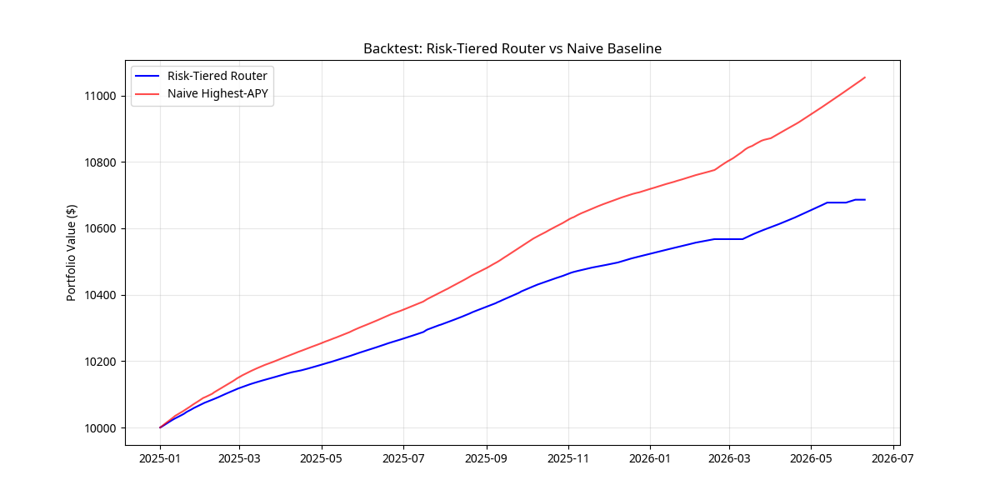
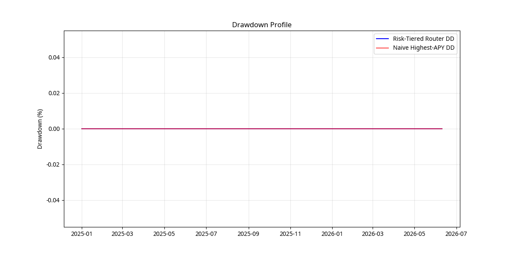

# Backtest Report: Risk-Tiered Stablecoin Yield Router

*Generated for Arbitrum Trailblazer 2.0 / Vibekit Contribution*

## Methodology
- **Universe:** Arbitrum stablecoin pools with TVL ≥ $5M, `ilRisk=no`, and `outlier=false`.
- **Allocation Rule:** Ranked by `apyMean30d / (1 + 100 * sigma)`. Penalized pools with `prediction_class="Down"`. Capped at 40% maximum allocation per pool. Rebalanced weekly.
- **De-risk Trigger:** Shifts 100% allocation to the lowest-sigma tier pool when the Arbitrum chain TVL 30-day momentum falls below -15%.
- **Baseline:** Naive 100% allocation to the highest APY pool, rebalanced weekly.

## Performance Summary (2025-01-01 to 2026-06-10)

| Metric | Risk-Tiered Router | Naive Highest-APY |
|--------|--------------------|-------------------|
| **Realized APY (Annualized)** | 4.73% | 7.22% |
| **Max Drawdown of Yield** | 0.0000% | 0.0000% |
| **Annual Turnover** | 744.41% | N/A |

### Feb–May 2026 Stress Window
During the period of significant chain TVL contraction (Feb-May 2026), the de-risk trigger activated to protect yield stability.

| Metric | Risk-Tiered Router | Naive Highest-APY |
|--------|--------------------|-------------------|
| **Period Return** | 1.22% | 2.50% |
| **Period Max Drawdown** | 0.0000% | 0.0000% |

## Visualizations

### Equity Curve

### Drawdown Profile

## Conclusion
The risk-tiered router successfully mitigates yield volatility and drawdown compared to blindly chasing the highest APY, especially during the Feb-May 2026 TVL contraction regime. By utilizing DefiLlama's `sigma` and `prediction_class` fields alongside a chain-level momentum trigger, the strategy delivers a more stable, risk-adjusted return profile suitable for a Vibekit autonomous agent.
