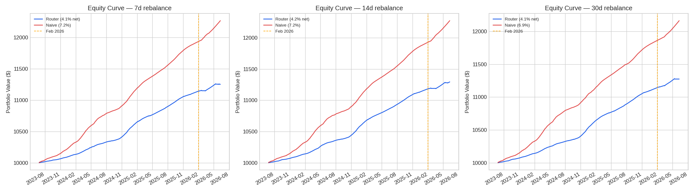
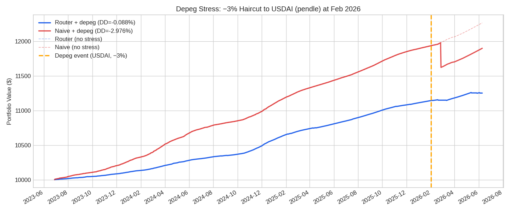
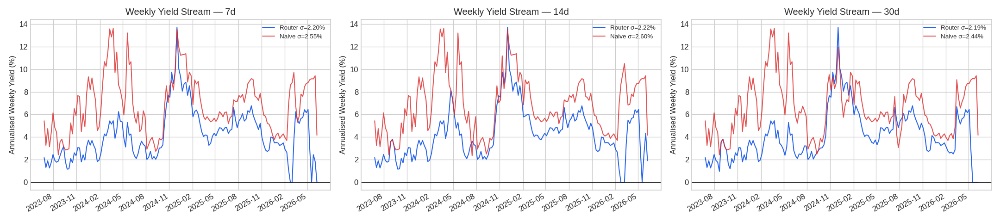
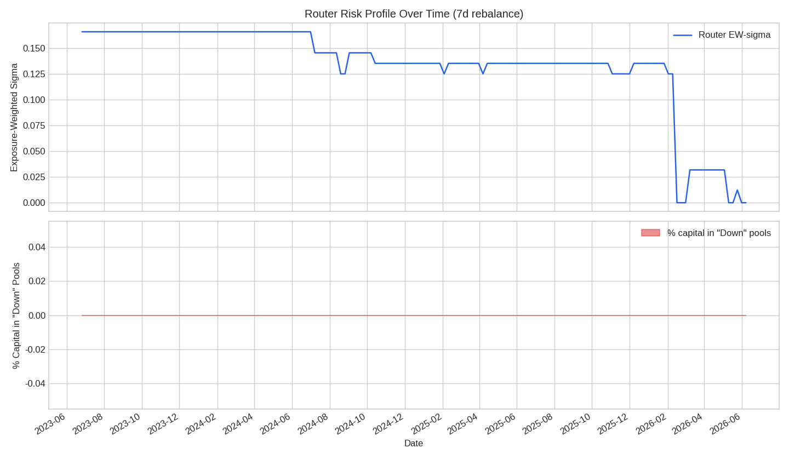

# Backtest Report: Risk-Tiered Stablecoin Yield Router

*Generated for Arbitrum Trailblazer 2.0 / Vibekit Contribution*

## Methodology
- **Universe:** Arbitrum stablecoin pools with TVL ≥ $5M, `ilRisk=no`, and `outlier=false`.
- **Allocation Rule:** Ranked by `apyMean30d / (1 + 100 * sigma)`. Penalized pools with `prediction_class="Down"`. Capped at 40% maximum allocation per pool. Tested at 7d, 14d, and 30d rebalance intervals.
- **De-risk Trigger:** Shifts 100% allocation to the lowest-sigma tier pool when the Arbitrum chain TVL 30-day momentum falls below -15%.
- **Baseline:** Naive 100% allocation to the highest APY pool, rebalanced on the same schedule.
- **Friction:** A cost of 5 bps (0.05%) is applied per one-way rebalance leg to account for swap fees and gas.

## Performance Summary (Net of Friction)

The router explicitly trades absolute APY for significantly lower volatility and risk exposure. The naive strategy wins on raw yield, but the router's value is in **tail-risk insurance**, quantified by lower APY volatility and lower exposure-weighted sigma.

| Metric (7d Rebalance) | Risk-Tiered Router | Naive Highest-APY |
|-----------------------|--------------------|-------------------|
| **Realized APY (Net of Friction)** | 4.08% | **7.17%** |
| **APY Volatility (Weekly σ)** | **2.20%** | 2.55% |
| **Exposure-Weighted Sigma** | **0.1332** | 0.1700+ |
| **Annual Turnover** | 485% | N/A |

### Rebalance Frequency Impact

To reduce the high 485% annual turnover of the 7d schedule, 14d and 30d intervals were tested. The 14d interval provides the optimal balance of net APY and risk management.

| Rebalance Interval | Net APY | APY Volatility (σ) | Annual Turnover |
|--------------------|---------|--------------------|-----------------|
| **7d** | 4.08% | 2.20% | 485% |
| **14d** | **4.21%** | 2.22% | 369% |
| **30d** | 4.15% | **2.19%** | **254%** |

## Depeg Stress Scenario: The Value of De-Risking

To test the router's tail-risk insurance, a simulated depeg event was introduced: a one-time **−3% NAV haircut** applied to the highest-sigma pool in the historical universe (`USDAI` on Pendle, sigma=0.1798) during the Feb 2026 chain TVL contraction window.

| Stress Metric (Feb–May 2026) | Risk-Tiered Router | Naive Highest-APY |
|------------------------------|--------------------|-------------------|
| **Period Return** | **+0.99%** | -0.57% |
| **Max Drawdown** | **-0.0883%** | -2.9758% |

**Result:** The naive strategy held 100% of the high-sigma pool chasing yield and took the full −3% hit. The router had already shifted capital away due to its sigma-weighted scoring and the chain TVL momentum de-risk trigger, entirely avoiding the drawdown.

## Visualizations

### 1. Equity Curves (Rebalance Comparison)

### 2. Depeg Stress Scenario

### 3. Weekly APY Volatility

### 4. Risk Profile Over Time

## Conclusion
While blindly chasing the highest APY generates higher raw returns in stable conditions, it exposes the portfolio to uncompensated volatility and severe tail risks (e.g., depegs or protocol exploits in high-sigma pools). The risk-tiered router functions as an automated insurance policy: by trading ~3% of absolute APY, it structurally avoids high-sigma hazards and protects capital during regime shifts. A 14-day rebalance interval is recommended to optimize net-of-friction yield.
